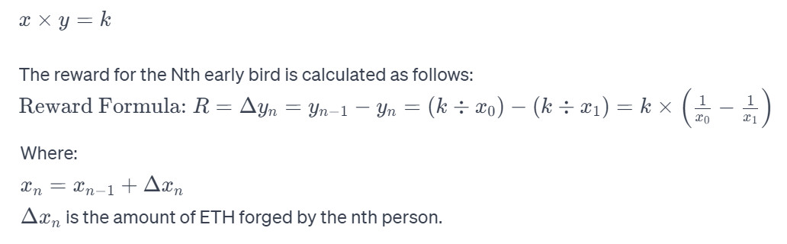

# 5. IADD Network

## Overview

Like its name, Instantly and Automatically Deployed Devaluation Network, IADD Network is a decentralized exchange network that is instantly and automatically deployed.  It servers for the decentralized valuation of dApps, exchange and universal payment (settlement).

Missions:

* Automatically deploying a decentralized exchange
* Automatically deploying a decentralized settlement(universal payment) network.
* A important part of Protocol of Unit Token.

"Natrural Dao" is a philosophical thought from the Tao Te Ching, meaning that the law reflected in everything is "Mother Natural". The principle of Dao follows the natural order, unbound by artificial constraints. Similarly, the IADD network we have designed adheres to this philosophy. By utilizing algorithms based on the inherent patterns of decentralized exchange and implementing control through smart contracts, the network has successfully deployed decentralized valuation, exchange and settlement infrastructure for tokenomics and dApp's development. It has actively contributed to the establishment of a pricing unit system as well.

* Perfectly Decentralized Price Discovery Mechanism and Abundant Liquidity\
  ① Bancor's innovation brought about a revolution in price discovery mechanisms, eliminating the need for order matching. It revealed that the collaboration of liquidity pools and algorithms in smart contract can achieve decentralized price discovery, enabling instant completion of exchanges for any number (and same number of different valuation tokens) of tokens. This innovation is undoubtedly worthy of being inherited by DAism.\
  ② The token price algorithm adopts the simpler Constant Product Market Maker of Uniswap.\
  Constant Product Market Maker is a model of market maker and generates token pricing in a non-linear way. CPMM is used by Uniswap, and we have imporved it.\
  ③ Valuation changes without distortion, fully reflecting investor judgments: DAism's Protocol of Valuation Token's Supply uniformly supplies all valuation tokens of each DAO directly to the IADD Network. And after the complete issuance of valuation tokens to the IADD Network, they become reserve currency, contributing to the establishment of liquidity pools in the market. The reserve currency achieves value discovery through automatic calculations and provides liquidity to the market without the need to consider the size of exchanges. This is a revolutionary protocol because the decentralized exchange network built upon it neither requires nor allows any human participation in liquidity provision!
*   Built-in Token Price Measurement System

    ① The unit system for valuation token prices is the only scientific means for blockchain (smart contracts) to obtain pricing power.\
    ② Do not doubt it; it will eliminate all current exchanges.\
    ③ It will completely solve the long-standing universal payment (settlement) issue in tokenomics for over a decade.\
    ④ It merges DEX and D-Payment into a single entity (2-in-1 network).
*   Smart Contracts Manage Everything, Completely Self-Operational

    ① The advantage of smart contract is its ability to run permanently.\
    ② Full self-operation means unmanned, i.e., resistance to human intervention.

## Main Protocols shaping IADD Network

1. Protocol of Unit Token\
   See below.
2. Protocol of Valuation Token's Supply\
   See the previous section.
3. Protocol of Decentralized Exchange\
   See the previous section.
4. Decentralized Payments Protocol\
   See the previous section.\
   The focus of this protocol is to provide a dedicated interface for payments and ultimately achieve significant improvements in Ethereum gas payments.

## Protocol of Unit Token

In this protocol, the basic price unit is vita, and the prototype of vita (pricing standard) is uToken, which means that the price of a uToken is defined as 1 vita. The issuance mechanism of uToken is named as **ETH Forge.** and uToken's precision is 18 bits, which means that attovita (10^-18vita) is the smallest denomination of price.

Name: Unit Token

Abbr: uToken

Symbol: uTOKEN

Basic Unit: vita

1 vita = 100 cent

**Units:**

| Base 10 | Name of Prefix | Symbol of Prefix |
| ------- | -------------- | ---------------- |
| 10^24   | yotta          | Y                |
| 10^21   | zetta          | Z                |
| 10^18   | exa            | E                |
| 10^15   | peta           | P                |
| 10^12   | tera           | T                |
| 10^9    | giga           | G                |
| 10^6    | mega           | M                |
| 10^3    | kilo           | k                |
| 10^2    | hecto          | h                |
| 10^1    | deca           | da               |
| 10^-1   | deci           | d                |
| 10^-2   | centi          | c                |
| 10^-3   | milli          | m                |
| 10^-6   | micro          | μ                |
| 10^-8   | sat            | s                |
| 10^-9   | nano           | n                |
| 10^-12  | pico           | p                |
| 10^-15  | femto          | f                |
| 10^-18  | atto           | a                |

### Motivation

First, let's review the related points from some protocols:

* All valuation tokens of each DAO are entirely issued to the IADD Network. What sets this approach apart from the commonly initial coin offering is that the DAO team is not responsible for the issuance of valuation tokens, and they do not receive any allocation of valuation tokens. This eliminates the possibility of dApp development teams exploiting valuation tokens to manipulate the market!
* With all valuation tokens of each DAO issued to the IADD Network, the prices of valuation tokens can genuinely reflect the market's real value assessment.

1. The International System of Units (French: Système International d'Unités, abbreviated as SI) is the most widely adopted standard system of measurement globally. For example, in 1793, the definition of weight (later changed to mass) was based on the weight of pure water at its freezing point with a volume of one cubic decimeter. It can be seen that the unit of weight is defined by a reference object (standard). With the introduction of the mass standard and its base unit, the weight (mass) of all things can be calculated through algorithms of a scale. uToken serves as the pricing prototype and vita is the basic unit of price.
2. The IADD Network adopts the algorithm of Uniswap (Constant Product Formula), but it calculates the prices of valuation tokens using uToken instead of ETH.
3. ETH Forging Protocol: This is a sub-protocol. Through the destruction of ETH, the unit of account token is issued, making it a variant of ETH. The unit of account token is not generated out of thin air but is issued through the transfer of ETH value. This is a decentralized forging model, as users have the autonomy to decide when and how much forging to undertake.
4. The initiation of the DAism forging contract signifies the first instance where Ethereum's homogeneous tokens have their independent decentralized pricing mechanism. It also heralds the end of an era where centralized exchanges dominate and exploit tokenomics.
5. Another crucial application area for uToken is decentralized settlement. As the prices of all other tokens fluctuate and cannot be stably held by consumers for everyday spending or investment exits, uToken, with its constant price (1 uToken ≡ 1 VITA), qualifies as the universal payment token (or settlement token) within the DAism's tokenomics.
6. The demand for blockchain payments is growing as tokenomics develops. Since we cannot currently calculate the future size of this demand for a specific period, there is a need for a universally used payment token with theoretically unlimited issuance.

This is a solution aimed at completely dismantling the interference and disruption caused by centralized exchanges in decentralized markets. It is also a solution for tokenomics settlement.

### Mechanism of ETH FORGING

This section requires you to understand Uniswap's constant product formula(automated market maker algorithm) in advance. Please refer to the following information for details.

Hayden Adams. 2018：[https://hackmd.io/@477aQ9OrQTCbVR3fq1Qzxg/HJ9jLsfTz?type=view.](https://hackmd.io/@477aQ9OrQTCbVR3fq1Qzxg/HJ9jLsfTz?type=view.)

And the discussion initiated by vitalik Buterin: [Improving front running resistance of x\*y=k market makers](https://ethresear.ch/t/improving-front-running-resistance-of-x-y-k-market-makers/1281)

This protocol will adopt the ETH forging model, issuing uToken with the current USD price of ETH as a reference. Its issuance mechanism is quite unique:

1. Forging Initialization\
   Upon protocol activation (i.e., when the contract is enabled), the algorithm initializes based on the defined price for each uToken, specifically 1 vita, and the historical highest price of ETH (currently $4870 USD). This means that 1 ETH can forge 4870 uTokens.
2.  Algorithm( Imporved Constant Product) provides forging rewards

    x: Amount of ETH in the forging pool\
    y: Amount of uToken in the forging pool\
    Fomula: \
    \
    \
    is the amount of ETH forged by the nth person.
3.  Initialization of K Value:

    We will use the total ETH burned as of November 30, 2022, under EIP-1559, as the initialized total ETH. I observed 2,750,240 ETH burned ([https://etherchain.org/burn](https://etherchain.org/burn)) on November 30, 2022, at 00:00 Hong Kong time, with a value of $3,320,364,758 USD, representing the global user's loss, we assume that these ETH have entered the forging pool.

    Simultaneously, we will use the product of these two meaningful data points as the K value for the early bird reward algorithm: \
    K = (2750240 \*3320364758)= 9,131,799,972,041,920 ≈ $9.1318e+15
4. Rewards Formula\
   X \* Y = $9.1318e+15
5. Forge Base\
   In the second year following the innovation of the highest ETH price (assuming it is V2, with the previous highest price being V1), the number of uTokens that can be forged with 1 ETH is adjusted to the value of this new highest price (i.e., V2). All historical forgers will receive forging compensation equal to (V2 - V1).\
   When the forged ETH reaches 60% of its total amount, the exchange base will no longer increase. Or when the ETH price reaches $487,000, the exchange base (487,000) will no longer increase. This is a price fuse mechanism with the external market.

## IADD Network

1. Realistically Mapping Market Demand : When creating a DAO, its valuation tokens will be issued according to the protocol and entirely distributed on the IADD Network.&#x20;
2. A common issue with Bancor and Uniswap is that the amount of coins staked in the reserve pool is often too low. This can lead to significant price fluctuations with even small trades, essentially introducing a leverage effect into the price dynamics and losing the rationality of market pricing. By issuing all valuation tokens into the liquidity pools of decentralized trading networks, subsequent price changes due to supply and demand can reflect the real valuation changes without any inherent leverage.\
   This mechanism has the following advantages:

* Valuation tokens are entirely issued on the IADD Network, and the DAO team holds none of them. Therefore, the IADD Network prevents the DAO team from immediately selling reserved valuation tokens for profit by minting a fake dApp.
* Capitals can no longer collude with dApp development teams to manipulate prices. For example, immediately selling all tokens when listed on an centralized exchange and buying back at a lower price after a significant drop. In IADD Network, however, the amount of funds required to control the market is a hundred times or even higher than before! And also, in an open and transparent market, the risk of going against the valuation consensus is also very very high!
* These two aspects essentially provide a good governance mechanism for the issuance of valuation tokens.
* In the early stages of a DAO, there is some protection for investors participating in the valuation market. Valuation tokens cannot drop below the issuance price of 0, preventing a situation where valuation tokens unreasonably plummet right after opening. Additionally, the first investors cannot incur losses (excluding transaction gas fees)!
* This introduces a natural mechanism for DAOs—a valuation token falling to 0 in the IADD Network indicates that the market believes the dApp developed by the DAO has no value. If it remains at 0 for an extended period, the dApp likely has failed!

## Advantages of IADD Network

1.  Instant Deployment

    Right after a DAO minted its valuation token will be reading for exchange.
2.  Automatical Deployment

    A valuation token's listing and trading are managed and automatically deployed by smart contracts.&#x20;
3. Unattended exchange and payments network\
   All existing decentralized exchanges need many users to support its running. The innovation of IADD is of great significance!
4.  Elimination of Privileges from Centralized Market Deployments

    This approach removes the privileges of project teams, centralized exchanges, and market manipulators. Aside from free trading, exchanges completely eliminate any human interference in the market.
5.  Introduction of a Scientific Method for Price Calculation in tokenomics.

    This marks a significant innovation in the history of human currency!
6.  A solid solution for Tokenomics settlement.

    uToken is recognized as the optimal settlement token for tokenomics' investment and retail markets (such as e-commerce). IADD provides two critical elements for tokenomics payments: uToken with an absolutely fixed price and a decentralized settlement network.
7.  The Most Rational Price Discovery Mechanism

    In the trading pairs of Bancor and Uniswap, the tokens staked in the reserves are circulating assets with owners. Even if the quantity reaches 5% of the total token supply (once the maximum suggested by Bancor), the price sensitivity of the trading pair is 20 times that of the total supply price sensitivity.

    The valuation token is fully supplied to IADD when it is issued, so its price rises and falls without any leverage effect. This is undoubtedly the most authentic price discovery mechanism.
8. Almost Zero Cost for DAO Teams, Easy Support\
   Mint with a dApp to get everything done. It brings great convenience to DAO teams.
9. In Full Compliance with the Core Values of Blockchain\
   It fully aligns with the core principles of decentralization and censorship resistance, etc.
10. Under decentralized conditions, it establishes a practical mechanism for the natural elimination of dApps.
