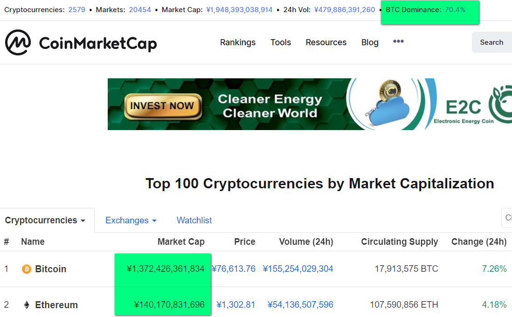

# Why here

There are some brand new concepts and beliefs in NaturalDAO. We think it is necessary to let people understand these as a starter, expecially when many people even distrust ethereum and today Bitcoin's Dominance is as high as 70.4% of the total blockchain market, while Ethereum's market cap is almost only 1/10 of Bitcoin's. 

